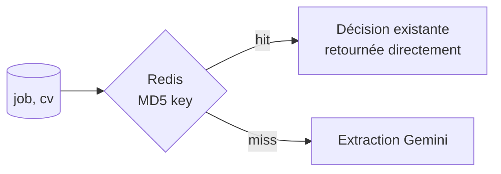

# Decision API — Agent de scoring décisionnel multi-critères

Un agent **Utility-based** qui transforme un CV brut en décision justifiée : extraction LLM → graphe de dépendances → fonction d'utilité → score final avec breakdown complet. Docker Compose up en 30s.

**Formats d'intégration :** API REST pure (Swagger). Docker Compose up en 30s.

---

## Architecture

```mermaid
flowchart TD
    subgraph "Entry"
        CURL[curl / API<br/>POST /api/decide]
    end

    subgraph "Backend FastAPI"
        API[POST /api/decide]
        CACHE{Redis ?}
        LLM[Extraction LLM<br/>Gemini]
        GRAPH[Graphe NetworkX<br/>ajustement poids]
        SCORE[Calcul U = Σ(w × f(x))]
        DB[(PostgreSQL<br/>décisions)]
    end

    subgraph "Réponse"
        BREAKDOWN[Breakdown JSON<br/>6 critères notés<br/>poids ajustés<br/>justifications]
    end

    CURL --> API
    API --> CACHE
    CACHE -->|hit → retour direct| BREAKDOWN
    CACHE -->|miss| LLM
    LLM -->|scores + justifications| GRAPH
    GRAPH -->|poids ajustés| SCORE
    SCORE -->|U final + breakdown| DB
    DB -->|décision stockée| BREAKDOWN
    SCORE --> CACHE
```

---

## How It Works

### 1. Entry — L'utilisateur soumet un job et un CV

```bash
curl -X POST http://localhost:8000/api/decide \
  -H "Content-Type: application/json" \
  -d '{"job": "Senior Software Engineer", "cv": "12 years Python backend, PhD CS"}'
```

### 2. Cache check — Éviter de ré-exécuter le LLM



### 3. Extraction LLM — Gemini analyse le CV

Le LLM extrait 6 scores (0-10) avec justifications texte :

```
skills_match: 9.0 — "Le candidat a 12 ans d'expérience backend, dont Python"
years_experience: 8.0 — "12 ans, au-dessus du seuil de 5 ans requis"
leadership: 5.0 — "PhD suggère une capacité d'analyse, pas de management"
domain_fit: 7.0 — "Expérience backend colle au poste"
education: 9.0 — "PhD en CS, formation de haut niveau"
communication: 6.0 — "CV bien structuré, pas de projet collaboratif mentionné"
```

### 4. Ajustement graphe — NetworkX modifie les poids

Le graphe de dépendances ajuste les poids selon 4 arêtes :

| Arête | Déclencheur | Effet |
|-------|-------------|-------|
| `leadership → BOOSTS → years_experience` | leadership > 5 | poids years_experience ×1.3 |
| `education → BOOSTS → skills_match` | education > 7 | poids skills_match ×1.3 |
| `domain_fit → PREREQUISITE_FOR → communication` | domain_fit < 3 | communication bloqué à 0 |
| `skills_match → PENALIZES → education` | skills_match < 3 | poids education ×0.5 |

### 5. Score final — Utility function

```
U = Σ(w × f(x))

skills_match:     9.0 × 0.25 = 2.25
years_experience: 8.0 × 0.20 = 1.60  (×1.3 boost = 2.08)
leadership:        5.0 × 0.15 = 0.75
domain_fit:        7.0 × 0.15 = 1.05
education:         9.0 × 0.15 = 1.35  (×0.5 penalize = 0.67)
communication:     6.0 × 0.10 = 0.60

U = 7.40/10 → ajusté à 7.15 (graphe actif)
```

### 6. Réponse — Breakdown complet

```json
{
  "candidate": {
    "name": "Alice Dupont",
    "criteria": [
      {"name": "skills_match", "score": 9.0, "weight": 0.25,
       "justification": "12 ans d'expérience backend Python"},
      {"name": "years_experience", "score": 8.0, "weight": 0.26,
       "justification": "12 ans, au-dessus du seuil requis"}
    ],
    "utility_score": 7.15
  },
  "graph_adjustments": {
    "years_experience": ["BOOST ×1.3 (leadership=5.0)"],
    "education": ["PENALISE ×0.5 (skills_match=9.0)"]
  }
}
```

La décision est stockée en PostgreSQL + cachée Redis. Ré-exécuter la même requête retourne le cache (sub-ms).

---

## Stack

| Couche | Technologie | Usage |
|--------|-------------|-------|
| **Backend** | Python 3.14 + FastAPI | API REST, extraction LLM, scoring |
| **BDD relationnelle** | PostgreSQL 17 + asyncpg | Stockage des décisions et audit trail |
| **Cache** | Redis 7 | Cache MD5 des décisions, TTL 1h |
| **Graphe** | NetworkX | Dépendances entre critères, ajustement poids |
| **Provider** | Gemini 2.5 Flash | Extraction scores + justifications depuis CV |
| **Tests** | pytest + pytest-asyncio (16 tests) | Domain, Graphe, API |
| **Infrastructure** | Docker Compose | 3 services : API + PostgreSQL + Redis |

---

## Quick Start

```bash
# 1. Démarrer l'infrastructure
docker compose up -d

# 2. Tester l'API
curl http://localhost:8000/api/health
# → {"status": "ok"}

# 3. Évaluer un candidat
curl -X POST http://localhost:8000/api/decide \
  -H "Content-Type: application/json" \
  -d '{
    "job": "Senior Software Engineer",
    "cv": "12 years Python backend development, PhD in Computer Science"
  }'

# 4. Voir Swagger UI
# → http://localhost:8000/docs

# 5. Récupérer une décision par ID
curl http://localhost:8000/api/decide/<id>
```

```yaml
# docker-compose.yml (extrait)
services:
  api: build . → port 8000
  postgres: postgres:17-alpine
  redis: redis:7-alpine

# Variables d'environnement requises :
# GEMINI_API_KEY=...
```

---

## Ce que ça prouve

### Compétences agentiques

| Compétence | Comment |
|------------|---------|
| **Utility function formelle** | `U = Σ(w × f(x))` avec 6 critères pondérés et ajustement dynamique |
| **LLM extraction structurée** | Gemini extrait scores + justifications depuis du texte libre CV |
| **Explainable AI** | Breakdown complet par critère : score, poids, justification texte |
| **Graphe de dépendances** | NetworkX ajuste les poids selon 4 arêtes (BOOST, PENALIZE, BLOCK) |
| **Cache pattern** | Redis MD5 : décision identique → retour cache, zéro appel LLM |
| **API-first design** | Pas d'UI, un service de décision pur avec Swagger |
| **Walking Skeleton** | Script zéro infra validé avant toute DB, Docker, ou API |
